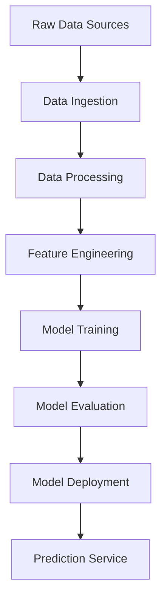

# Credit Risk Analysis Pipeline

This repository contains a complete pipeline for performing credit risk analysis using banking and CIBIL data. The project aims to classify customers into different risk levels to assess the likelihood of loan default, ultimately aiding in better lending decisions by financial institutions.

## System Design

### Architecture Overview

The system follows a modular, pipeline-based architecture with the following key components:

1. **Data Ingestion Layer**
   - Handles raw data loading from multiple sources (banking data, CIBIL reports)
   - Implements data validation and integrity checks
   - Supports both batch and real-time data processing

2. **Data Processing Layer**
   - Data cleaning and preprocessing
   - Feature engineering and selection
   - Handling missing values and outliers
   - Data normalization and standardization

3. **Model Training Layer**
   - Model selection and training
   - Hyperparameter optimization
   - Cross-validation
   - Model persistence

4. **Evaluation Layer**
   - Performance metrics calculation
   - Model comparison
   - Error analysis
   - Model validation

5. **Deployment Layer**
   - Model serving
   - API endpoints
   - Monitoring and logging
   - Model versioning

### Data Flow



### Component Details

#### 1. Data Ingestion Layer
- **Input Sources**:
  - Banking transaction data
  - CIBIL credit reports
  - Customer demographic information
- **Data Validation**:
  - Schema validation
  - Data type checking
  - Missing value detection
  - Duplicate record handling

#### 2. Data Processing Layer
- **Preprocessing Steps**:
  - Data cleaning
  - Outlier detection and treatment
  - Missing value imputation
  - Data type conversion
- **Feature Engineering**:
  - Statistical feature creation
  - Time-based feature extraction
  - Domain-specific feature generation
  - Feature selection using statistical tests

#### 3. Model Training Layer
- **Model Pipeline**:
  - Data splitting (train/validation/test)
  - Feature scaling
  - Model training
  - Cross-validation
- **Hyperparameter Tuning**:
  - Grid search
  - Random search
  - Bayesian optimization
- **Model Selection**:
  - Performance comparison
  - Model interpretability
  - Computational efficiency

#### 4. Evaluation Layer
- **Metrics**:
  - Accuracy
  - Precision
  - Recall
  - F1-score
  - ROC-AUC
  - Confusion matrix
- **Validation**:
  - Cross-validation
  - Hold-out validation
  - Time-based validation

#### 5. Deployment Layer
- **Model Serving**:
  - REST API endpoints
  - Batch prediction service
  - Real-time prediction service
- **Monitoring**:
  - Model performance tracking
  - Data drift detection
  - System health monitoring
- **Versioning**:
  - Model version control
  - Feature store versioning
  - API versioning

### System Requirements

#### Hardware Requirements
- Minimum 8GB RAM
- 4+ CPU cores
- 50GB storage space

#### Software Requirements
- Python 3.6+
- CUDA support (optional, for GPU acceleration)
- Operating System: Linux/Windows/MacOS

### Performance Considerations

1. **Scalability**
   - Horizontal scaling for data processing
   - Distributed computing support
   - Batch processing optimization

2. **Reliability**
   - Error handling and recovery
   - Data backup and recovery
   - System redundancy

3. **Security**
   - Data encryption
   - Access control
   - Audit logging

4. **Maintainability**
   - Modular code structure
   - Comprehensive documentation
   - Automated testing

## Files and Directories

- **data_loading_and_preprocessing.py**: Loads, cleans, and merges raw datasets.
- **feature_engineering.py**: Selects relevant features based on statistical tests and removes multicollinearity.
- **encoding_and_scaling.py**: Encodes categorical variables and scales numerical features.
- **model_training.py**: Trains machine learning models (Random Forest, XGBoost, Decision Tree).
- **model_evaluation.py**: Evaluates the trained models using various metrics.
- **hyperparameter_tuning.py**: Conducts hyperparameter tuning for the XGBoost model using GridSearchCV.
- **test_on_unseen_data.py**: Applies the trained model to unseen data for testing.
- **main.py**: Orchestrates the entire pipeline by sequentially executing each script.
- **README.md**: Provides detailed documentation of the project.

## Dataset Scale and Structure

The dataset used in this project is saved as `preprocessed_data.csv` and has the following scale and structure:

- **Number of Records**: 42,065 rows, each representing an individual customer profile.
- **Number of Features**: 76 features covering a wide range of financial, demographic, and credit history information.

### Feature Highlights

Here is an overview of key features in the dataset:

- **PROSPECTID**: Unique identifier for each customer.
- **Credit History Features**:
  - `Total_TL`: Total trade lines/accounts in Bureau.
  - `Tot_Closed_TL`: Total closed trade lines/accounts.
  - `Tot_Active_TL`: Total active trade lines/accounts.
  - `Total_TL_opened_L6M`: Total accounts opened in the last 6 months.
  - `Tot_TL_closed_L6M`: Total accounts closed in the last 6 months.
  - `pct_tl_open_L6M`: Percentage of trade lines opened in the last 6 months.
  - `pct_tl_closed_L6M`: Percentage of trade lines closed in the last 6 months.
  - `pct_active_tl`: Percentage of active trade lines.
  - `pct_closed_tl`: Percentage of closed trade lines.
  - `Total_TL_opened_L12M`: Total accounts opened in the last 12 months.
  - `Tot_TL_closed_L12M`: Total accounts closed in the last 12 months.
  - `pct_tl_open_L12M`: Percentage of trade lines opened in the last 12 months.
  - `pct_tl_closed_L12M`: Percentage of trade lines closed in the last 12 months.
  - `Tot_Missed_Pmnt`: Total missed payments.
  - `CC_TL`, `Home_TL`, `PL_TL`, `Secured_TL`, `Unsecured_TL`, `Other_TL`: Different types of trade lines (Credit Cards, Home Loans, Personal Loans, Secured Loans, Unsecured Loans, Other Loans).
  - `Age_Oldest_TL`: Age of the oldest trade line.
  - `Age_Newest_TL`: Age of the newest trade line.
  - `time_since_recent_payment`: Time since the most recent payment.
  - `max_recent_level_of_deliq`: Maximum recent delinquency level.
  - `num_deliq_6_12mts`: Number of delinquencies in the last 6-12 months.
  - `num_times_60p_dpd`: Number of times 60+ days past due.
  - `num_std_12mts`: Number of standard payments in the last 12 months.
  - `num_sub`, `num_sub_6mts`, `num_sub_12mts`: Number of substandard payments.
  - `num_dbt`, `num_dbt_12mts`: Number of debts.
  - `num_lss`, `num_lss_12mts`: Number of losses.
  - `recent_level_of_deliq`: Recent delinquency level.
  - `CC_enq_L12m`, `PL_enq_L12m`: Number of Credit Card and Personal Loan inquiries in the last 12 months.
  - `time_since_recent_enq`: Time since the most recent inquiry.
  - `enq_L3m`: Number of inquiries in the last 3 months.
- **Demographic Features**:
  - `MARITALSTATUS`: Marital status of the customer.
  - `EDUCATION`: Education level of the customer.
  - `AGE`: Age of the customer.
  - `GENDER`: Gender of the customer.
- **Income and Employment Features**:
  - `NETMONTHLYINCOME`: Net monthly income of the customer.
  - `Time_With_Curr_Empr`: Time with the current employer.
- **Flags and Scores**:
  - `pct_of_active_TLs_ever`, `pct_opened_TLs_L6m_of_L12m`, `pct_currentBal_all_TL`: Various percentage metrics related to trade lines.
  - `CC_Flag`, `PL_Flag`, `HL_Flag`, `GL_Flag`: Flags indicating different types of loans (Credit Card, Personal Loan, Housing Loan, Gold Loan).
  - `last_prod_enq2`, `first_prod_enq2`: Last and first product inquiries.
  - `Credit_Score`: Customer's credit score.
  - `Approved_Flag`: Target label indicating the risk category (P1, P2, P3, P4).

The goal of this analysis is to categorize customers into one of four risk levels, which are defined as follows:

- **P1 (Prime or Low-Risk)**:
  - Customers are deemed highly creditworthy with a low likelihood of default.
  - They typically have strong credit scores, minimal or no delinquencies, and stable financial histories.
  - P1 customers are offered the best loan terms and lowest interest rates due to their reliability.
- **P2 (Moderate Risk)**:
  - Customers in this category present a moderate risk level.
  - While generally creditworthy, they may have a few risk factors like minor payment delays.
  - P2 customers may receive standard loan terms with slightly higher interest rates than P1.
- **P3 (Subprime or High-Risk)**:
  - Considered high-risk, P3 customers often have lower credit scores and a history of missed payments.
  - They may still qualify for loans but usually at higher interest rates to compensate for the increased risk.
- **P4 (Very High-Risk)**:
  - P4 represents very high-risk customers with significant default potential.
  - These customers may have poor credit histories and recent delinquencies.
  - Financial institutions might decline P4 customers or provide loans under stringent conditions and very high interest rates.

These categories enable banks to segment customers by risk level, helping them to set appropriate loan terms, interest rates, and credit limits.

## Model Evaluation

To classify customers into the risk categories, we evaluated three machine learning models: **Decision Tree, Random Forest, and XGBoost**. The models were assessed on the following key metrics:

1. **Accuracy**: Measures the overall percentage of correct predictions.
2. **Precision and Recall**: Provides insight into each class's true positive rate and the proportion of correctly identified positives.
3. **F1-Score**: Balances precision and recall, particularly useful for imbalanced datasets.
4. **Macro and Weighted Average F1-Scores**: The macro average treats each class equally, while the weighted average adjusts for class imbalances, offering a more holistic view of model performance.

### Results Summary

| Model         | Accuracy | Macro Avg F1 | Weighted Avg F1 |
| ------------- | -------- | ------------ | --------------- |
| Decision Tree | 0.71     | 0.62         | 0.70            |
| Random Forest | 0.77     | 0.66         | 0.74            |
| XGBoost       | 0.77     | 0.68         | 0.76            |

### Model Selection

**XGBoost** was selected as the best model for this task based on:

- **Higher Weighted F1-Score**: XGBoost achieved a weighted F1-score of 0.76, indicating it effectively balances performance across classes, especially those with more samples.
- **Performance on Challenging Classes**: XGBoost achieved higher precision and recall for the difficult-to-predict class (P3) than Random Forest and Decision Tree, handling class imbalance effectively.
- **Consistency Across Metrics**: With the highest macro and weighted F1-scores, XGBoost is the most robust option for handling this classification problem.

Thus, **XGBoost is the preferred model** due to its balanced and reliable performance across all metrics, making it well-suited for classifying credit risk in a diverse customer base.

## Setup

### Prerequisites

- **Python 3.6** or higher
- **Libraries**: Install necessary dependencies by running:

  ```bash
  pip install numpy pandas matplotlib scikit-learn statsmodels xgboost
  ```

### Installation

1. Clone the repository:
   ```bash
   git clone https://github.com/yourusername/credit-risk-analysis.git
   cd credit-risk-analysis
   ```

2. Create a virtual environment:
   ```bash
   python -m venv venv
   source venv/bin/activate  # On Windows: venv\Scripts\activate
   ```

3. Install dependencies:
   ```bash
   pip install -r requirements.txt
   ```

### Usage

1. Data Preparation:
   ```bash
   python data_loading_and_preprocessing.py
   ```

2. Feature Engineering:
   ```bash
   python feature_engineering.py
   ```

3. Model Training:
   ```bash
   python model_training.py
   ```

4. Model Evaluation:
   ```bash
   python model_evaluation.py
   ```

5. Run Complete Pipeline:
   ```bash
   python main.py
   ```

### Configuration

The system can be configured through the `config.yaml` file, which includes settings for:
- Data paths
- Model parameters
- Feature selection criteria
- Evaluation metrics
- System resources

## Contributing

1. Fork the repository
2. Create a feature branch
3. Commit your changes
4. Push to the branch
5. Create a Pull Request

## License

This project is licensed under the MIT License - see the LICENSE file for details.
